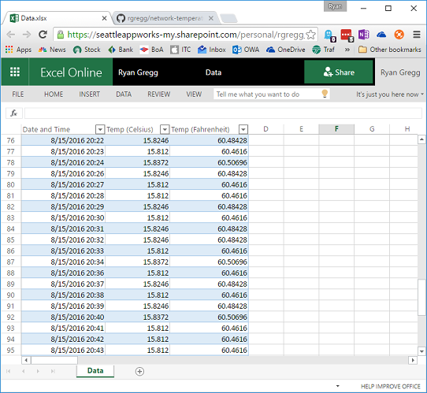

# Network Temperature Recorder

This project implements a simple console application that reads temperature values from a supported reader, and records the value out to a supported recorder.
It is designed to be run from an embedded device, like a Raspberry Pi, and left running to continiously monitor temperature.




### Supported temperature readers

* [One wire digital temperature sensors (like DS18B20)](#one-wire-hardware-configuration)
* Simulator

### Supported data recorders

* [OneDrive for Business / Office 365](#onedrive-for-business-configuration)
* Console output

## One Wire Hardware Configuration

For more information about the hardware configuration to enable one wire devices with Raspberry Pi, see [Adafruit Lesson 11](https://learn.adafruit.com/adafruits-raspberry-pi-lesson-11-ds18b20-temperature-sensing/hardware).

## OneDrive for Business Configuration
 
To use the temperature recorder with OneDrive for Business, follow the following steps:

1. Register a new application using Azure Active Directory. See [register your app for OneDrive for Business](https://dev.onedrive.com/app-registration.htm#register-your-app-for-onedrive-for-business) for more information.
   * Make sure to request the `Files.ReadWrite` scope.
2. Modify the `~/.iotTempRecorder.rc` file as mentioned below.
   Be sure to include your client ID, username, and password.
   This application uses the username+password flow instead of a traditional OAuth flow since it works as a command line utility and cannot use a web interface.
3. If you are using Mono, ensure that the SSL certificates used by `logon.microsoftonline.com` and `graph.microsoft.com` are trusted by Mono. See [Mono FAQ: security](http://www.mono-project.com/docs/faq/security/) for more information.

### Example Excel file

To record data to Excel, you need to create an Excel file that will hold the data. The tool will write the data values into a table named `RecordedData`.
This table is expected to contain the following columns, in order:

* Date and Time
* Temperature (Celsius)
* Temperature (Fahrenheit)

Additional columns can be added to the table after these first three, since the app only expects these columns.
The name of the column is not important, only that they are in the correct order.

See [ExampleData](ExampleData.xlsx) for an example of the required file format.

## Configuration File

The temperature recorder app looks for a default configuration file at `~/.iotTempRecorder.rc`.
The format of this file is a JSON dictionary that can contain the following properties:

| Name | Value | Description |
|---|---|---|
| TemperaturePollingIntervalSeconds | Int32 | The number of seconds to wait between capturing a temperature data point. Default: 60. |
| DataRecorder | String | Specify the data recorder to use. Allowed values are `Console` and `Office365`. |
| TemperatureSource | String | Specify the source of temperature readings. Allowed values are `OneWire` or `Simulator`. |
| CloudDataFilePath | String | Specify the relative path to an Excel file that will be updated with the recorded values. |
| Office365UserName | String | The username for the Office 365 account. |
| Office365Password | String | The password for the Office 365 account. |
| Office365ClientId | String | The client ID (guid) for the application registered with Azure Active Directory. |
| Office365TokenService | String | The token authority for authentication. Should specify `https://login.microsoftonline.com/common`. |
| Office365ResourceUrl | String | The resource URI to generate tokens for. Should specify `https://graph.microsoft.com`. |

### Example configuration file

```json
{
"TemperaturePollingIntervalSeconds": 60,
"Office365UserName": "foo@contoso.com",
"Office365Password": "password",
"CloudDataFilePath": "DataLogger/Temperatures.xlsx",
"Office365ClientId": "guid-here",
"Office365TokenService": "https://login.microsoftonline.com/common",
"Office365ResourceUrl": "https://graph.microsoft.com",
"DataRecorder": "Office365",
"TemperatureSource": "OneWire"
}
```


## Extending supported readers / recorders

Both the data input and recorder output are abstracted through basic interfaces. 
To extend this program to support reading from a different type of temperature sensor or recording to a different output device, you just need to implement either `IDataRecorder` or `ITemperatureReader`.


## License

See [License](LICENSE) for more details.


